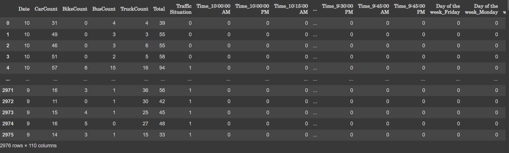
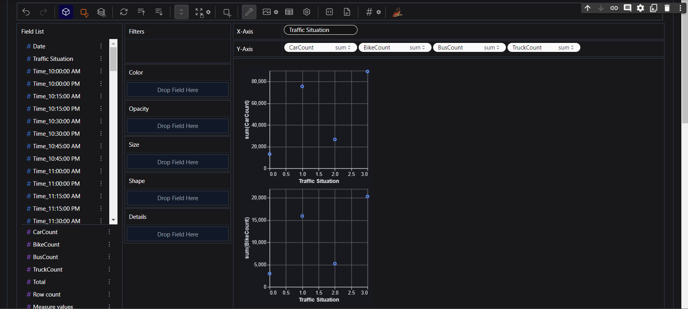
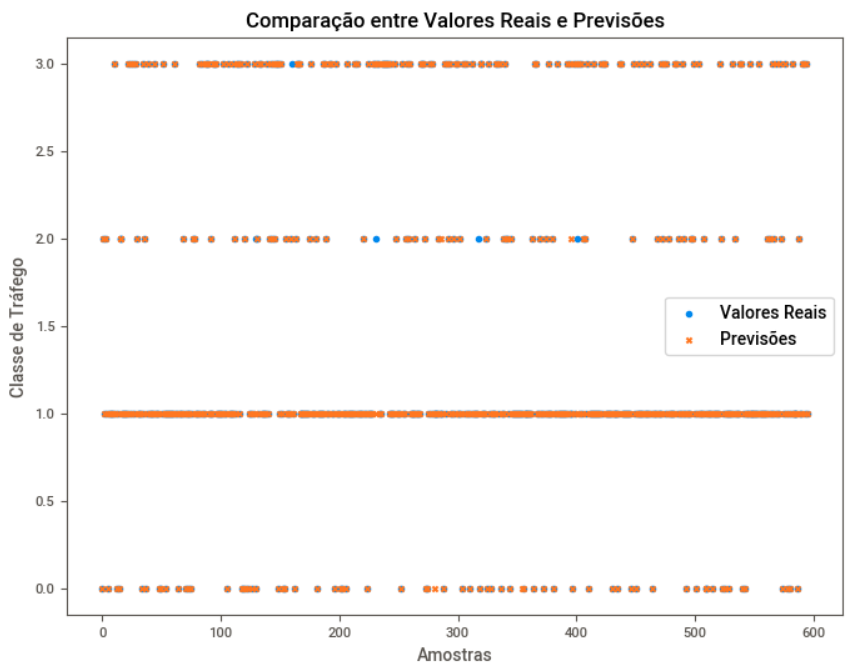

# Modelo de previsão de Tráfego com Decision Tree


Este é um repositório que contém um modelo de classificação de tráfego rodoviário usando uma árvore de decisão. O modelo é criado com base em dados de tráfego e usa a biblioteca Python `pygwalker` para auxiliar na preparação dos dados. Além disso, ele inclui visualizações para avaliar as previsões do modelo.

## Pré-requisitos

Certifique-se de ter as seguintes bibliotecas Python instaladas antes de executar o código:

- pandas
- scikit-learn
- pygwalker
- matplotlib

Você pode instalar as bibliotecas usando o pip:

```bash
pip install pandas scikit-learn tensorflow pygwalker matplotlib
```

## Uso
Siga as etapas a seguir para executar o código:

- Importe as bibliotecas necessárias:
```python
import pandas as pd
from sklearn.model_selection import train_test_split
from sklearn.preprocessing import MinMaxScaler
import tensorflow as tf
import pygwalker as pg
import matplotlib.pyplot as plt
```

- Carregue os dados de tráfego de um arquivo CSV:
```python
trafego = pd.read_csv("Traffic.csv")
```



- Faça a preparação dos dados, incluindo a substituição de categorias por valores numéricos e a criação de variáveis dummy:

```python
trafego = trafego.replace("low", 0)
trafego = trafego.replace("normal", 1)
trafego = trafego.replace("high", 2)
trafego = trafego.replace("heavy", 3)
trafego = pd.get_dummies(trafego)
```

- Realize a caminhada dos dados para explorar e entender o conjunto de dados:

```python
pg.walk(trafego)
```



- Separe os dados em conjuntos de treinamento e teste:

```python
x = trafego.drop("Traffic Situation", axis=1)
y = trafego["Traffic Situation"]
x_train, x_test, y_train, y_test = train_test_split(x, y, test_size=0.2, random_state=42)
```

- Normalize os dados usando Min-Max Scaling:

```python
scaler = MinMaxScaler()
X_train = scaler.fit_transform(x_train)
X_test = scaler.fit_transform(x_test)
```

- Crie um modelo de classificação de árvore de decisão e treine-o:

```python
from sklearn.tree import DecisionTreeClassifier
clf = DecisionTreeClassifier(random_state=42)
clf.fit(X_train, y_train)
```

- Faça previsões com o modelo treinado e calcule a precisão:

```python
pred = clf.predict(X_test)
from sklearn.metrics import accuracy_score
acc = accuracy_score(y_test, pred)
print("A precisão do modelo é de: {:.2%}".format(acc))
>>> "A precisão do modelo é de: 98.49%"
```

- Visualize as previsões comparadas com os valores reais:

```python
plt.figure(figsize=(8, 6))
plt.scatter(range(len(y_test)), y_test, label="Valores Reais", marker='o')
plt.scatter(range(len(pred)), pred, label="Previsões", marker='x')
plt.xlabel("Dados")
plt.ylabel("Tráfego")
plt.title("Comparação entre Valores Reais e Previsões")
plt.legend()
plt.show()
```



## Contribuindo
Sinta-se à vontade para contribuir com melhorias, correções de bugs ou novos recursos para este repositório. Basta fazer um fork do projeto, criar uma branch para suas alterações e enviar um pull request.
